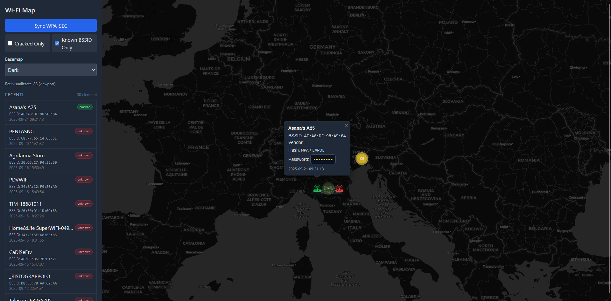

# 🗺️ Pwnmap

Pwnmap is a **Pwnagotchi plugin** and a **self-hosted map** to visualize captured Wi-Fi networks.

---

## Preview



---

## Installation

### 1) Install system packages
```bash
sudo apt update
sudo apt install -y python3 python3-venv python3-pip git
```

### 2) Clone the repository
```bash
git clone https://github.com/Sapu98/pwnmap
cd pwnmap
```

### 3) Configure environment
edit the `.env` file in the project root and add your secrets.

Example `.env`:
```env
# Server
PWNMAP_SERVER_BIND=0.0.0.0
PWNMAP_SERVER_PORT=1337

# Admin token (change this example on both the plugin and here)
PWNMAP_AUTH_TOKEN=34545867945987356782315640385123

# WPA-SEC
PWNMAP_WPASEC_URL=https://wpa-sec.stanev.org
PWNMAP_WPASEC_KEY=(YOUR KEY)

# SQLite + data dir
PWNMAP_DATA_DIR=data
PWNMAP_DB_PATH=data/pwnmap.db
PWNMAP_VENDOR_OUI_CSV=data/meta/vendor_oui.csv
```
### 4) Create and activate virtual environment
```bash
python3 -m venv .venv
source .venv/bin/activate
```

### 5) Install dependencies
```bash
pip install --upgrade pip
pip install -r requirements.txt
```

### 6) Run the backend (test)
```bash
python -m uvicorn backend.app:app --host 0.0.0.0 --port 1337
```

Open in browser: `http://127.0.0.1:1337` (replace with your machine IP).

---

## 🔌 Pwnagotchi plugin installation

1. Copy `pwnamap_uploader.py` from the repo into your Pwnagotchi custom plugins directory (example: `/usr/local/share/pwnagotchi/custom-plugins/`).

2. Add to `config.toml` on the Pwnagotchi device:
```toml
main.plugins.pwnamap_uploader.enabled = true
main.plugins.pwnamap_uploader.server_url = "https://<your-server-domain-or-ip>/api/upload"
main.plugins.pwnamap_uploader.api_token = "<API_TOKEN_FROM_ENV>"
main.plugins.pwnamap_uploader.handshakes_dir = "/home/pi/handshakes/"
main.plugins.pwnamap_uploader.interval_sec = 300
main.plugins.pwnamap_uploader.faces = true
```

3. Restart Pwnagotchi:
```bash
sudo service pwnagotchi restart
```

---
